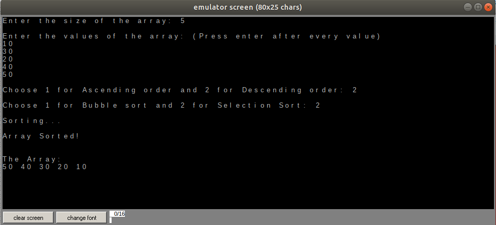

# SORT IT

Sort It is a program written in assembly which aims to perform 'next-number-check' sorting using Bubble and Selection Sort.

## Software needed

The program is built on ***emu8086 emulator*** and uses its inbuilt functions.

## What has been accomplished?

- The program takes input from the user and has toggles for choosing between ascending and descending order and between bubble and selection sort

## Structure

- The program has been divided into 9 modules: ___MAIN___, ___take_input___, ___print_array___ and ___sort_bubble_asc___, ___sort_bubble_desc___, ___sort_select_asc___, ___sort_select_desc___, ___asc_or_desc___, ___selection_or_bubble___

## FLOW

MAIN -> Take Input -> asc_or_desc -> selection_or_bubble (which calls the appropriate functions) -> print_array

#### CREDITS

Created by: [Ritvij Srivastava](https://github.com/RitvijSrivastava)